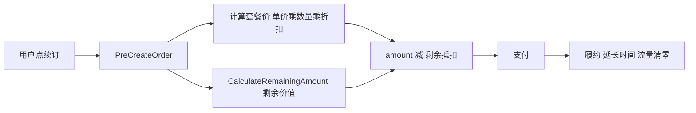
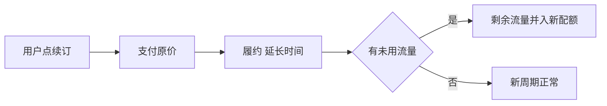

# 续订时"剩余流量变现"方案对比

> 背景：用户反馈续订到支付页无折扣、剩余流量未变现。
> 目标：梳理"续订/变更订阅时如何体现剩余流量价值"的可行方案与实现成本，供决策。

---

## 一、现状（代码事实）

- **续订定价**（[`renewal.go`](backend/internal/module/billing/internal/checkout/renewal.go:72)）：
  `amount = 单价 × 数量 × 套餐折扣 - 优惠券 - 赠金 - 手续费`，**不含任何剩余价值抵扣**。
- **续订履约**（[`fulfillment/service.go`](backend/internal/module/subscription/internal/fulfillment/service.go:271) `updateSubscriptionForRenewalTx`）：
  **有条件清零**——仅当满足以下任一条件时清零 `Download/Upload`：
  1. 套餐 `RenewalReset=true`；
  2. 续订日恰为到期日所在日（`today == resetDay`，重置边界）；
  3. 订阅曾结束且已过重置日（`FinishedAt` 早于当前）。
  否则**已用流量保留、剩余流量顺延进新周期**（配额 `Traffic` 不累加）；无论是否清零，都只延长到期时间、不涉及任何价值抵扣。
- **变更订阅（现状实为"另购新套餐"）**（前端 [`change-subscription.tsx`](frontend/apps/user/src/sections/subscribe/change-subscription.tsx:22) 仅列出其它套餐并打开购买弹窗 [`purchase.tsx`](frontend/apps/user/src/sections/subscribe/purchase.tsx:102)；后端走**新购**订单 Type=1，履约 [`createUserSubscriptionTx`](backend/internal/module/subscription/internal/fulfillment/service.go:216) 创建全新订阅、新 token、到期重算）：
  **完全不处理旧订阅剩余流量**——不迁移、不抵扣、不结转；单订阅模式下还须先退订旧订阅（`HasBlockingSubscription` 校验）。
- **付费重置流量**（[`resettraffic.go`](backend/internal/module/billing/internal/checkout/resettraffic.go:22) 建单 + [`activateResetTrafficTx`](backend/internal/module/subscription/internal/fulfillment/service.go:294) 履约）：
  按套餐重置价 `Replacement` 收费，履约时 `Download/Upload` **整体清零**（已用与未用一并归零）、`Status=1`、`FinishedAt=nil`，到期时间不变。
- **剩余价值折算**（[`deduction.go`](backend/pkg/deduction/deduction.go:154) `CalculateRemainingAmount`）：
  已存在完整实现——按剩余时间与剩余流量的比例折算（`DeductionRatio=0` 时取两者较小值，否则按流量/时间权重加权），**但目前只被"退订退款"使用**（[`unsubscribe.go`](backend/internal/module/subscription/internal/selfsub/unsubscribe.go:87)）。

结论：系统"会算剩余价值"，但"续订/变更时没有用它抵扣"；"变更订阅"本身只是新购，旧订阅剩余流量唯一可"变现"路径是退订退款。

---

## 二、方案对比

### 方案 A：续订折价（剩余价值抵扣续订费用）

- **行为**：续订时，用 `CalculateRemainingAmount` 算出当前订阅剩余价值，直接抵减新续订金额。
- **改动点**：
  - 后端：[`precreate.go`](backend/internal/module/billing/internal/checkout/precreate.go) 与 [`renewal.go`](backend/internal/module/billing/internal/checkout/renewal.go) 引入剩余抵扣计算；订单新增抵扣金额字段（涉及表结构变更）。
  - 前端：[`renewal.tsx`](frontend/apps/user/src/sections/subscribe/renewal.tsx) 与 [`billing.tsx`](frontend/apps/user/src/sections/subscribe/billing.tsx) 增加"剩余价值抵扣"账单行。
- **优点**：最符合"变现"直觉，用户续订立刻看到抵扣金额。
- **缺点 / 风险**：
  - 与"退订退款"逻辑纠缠：若续订已抵扣剩余价值、续订后流量仍清零，用户会觉得"流量白扣"；若不清零则等于双重优惠，规则难自洽。
  - 需处理抵扣后金额 ≤ 0（是否允许 0 元续订）、与优惠券/赠金叠加顺序。
  - 订单表加字段 → 数据库变更 + 存量兼容。
- **实现复杂度**：中高。

### 方案 B：流量结转（续订流量顺延、不清零）

- **行为**：续订时未用完的流量累加进下一个周期；已用完则正常新周期。
- **改动点**：
  - 后端：仅改 [`updateSubscriptionForRenewalTx`](backend/internal/module/subscription/internal/fulfillment/service.go:271)——续订时不把 `Download/Upload` 清零，而是把剩余流量并入新配额。
  - 前端：[`renewal.tsx`](frontend/apps/user/src/sections/subscribe/renewal.tsx) 增加"未使用流量将结转"提示。
- **优点**：
  - 改动**最集中**（主要一处履约逻辑），无数据库结构变更、无跨模块事务、无订单模型改动。
  - 用户友好：流量不浪费，符合机场/面板常见做法。
- **缺点 / 风险**：
  - 流量累加可能无上限增长（需设结转上限，如 ≤1 倍月配额）。
  - 与 `RenewalReset`（续订重置流量）配置冲突，需明确优先级。
  - 相当于赠送流量，影响营收口径与成本核算。
- **实现复杂度**：低。

### 方案 C：变更订阅抵扣（换套餐时旧订阅剩余价值抵扣新套餐）

- **行为**：用户通过"变更订阅"换套餐时，旧订阅剩余价值（时间+流量按 `DeductionRatio` 折算）抵扣新套餐费用；普通续订不抵扣。
- **改动点**：
  - 后端：新增"变更订阅"接口（订单类型 Type=4）、复用 `CalculateRemainingAmount`、订单加抵扣字段。
  - 编排：跨模块（支付=billing、退订=subscription、激活=fulfillment）需走 outbox/inbox 幂等编排，支付成功后自动退旧 + 激活新。
  - 前端：完整化"变更订阅"流程（选择套餐 → 显示抵扣 → 支付）。
- **优点**：符合行业"升级/降级"惯例，剩余价值在换套餐场景充分变现，用户心智清晰。
- **缺点 / 风险**：**改动量最大**——新订单类型、新接口、数据库字段、跨模块事务编排、前端流程全部涉及，回归面广。
- **实现复杂度**：高。

### 方案 D：展示性优化（仅提示，不做抵扣）

- **行为**：续订/变更页面展示当前订阅剩余价值（复用 `PreUnsubscribe`），并提示"未使用流量续订后将被清零"或"可先退订变现"。
- **改动点**：前端 [`renewal.tsx`](frontend/apps/user/src/sections/subscribe/renewal.tsx) / [`change-subscription.tsx`](frontend/apps/user/src/sections/subscribe/change-subscription.tsx) 增加文案与剩余价值展示；后端基本无改动。
- **优点**：成本极低、无业务风险，让用户知情。
- **缺点**：没有真正"变现"，不满足核心诉求，只能作为过渡或辅助。
- **实现复杂度**：极低。

---

## 三、对比表

| 方案 | 用户感知 | 后端改动 | 前端改动 | 数据库变更 | 跨模块事务 | 业务风险 | 复杂度 |
|------|----------|----------|----------|------------|------------|----------|--------|
| A 续订折价 | 立即抵扣 | 中 | 中 | 是 | 无 | 高（与退款纠缠） | 中高 |
| B 流量结转 | 流量不浪费 | 小 | 小 | 否 | 无 | 中（配额/口径） | 低 |
| C 变更抵扣 | 换套餐抵扣 | 大 | 大 | 是 | 是 | 中 | 高 |
| D 仅提示 | 仅知情 | 无 | 小 | 否 | 无 | 无 | 极低 |

---

## 四、数据流示意

### 方案 A：续订折价

### 方案 B：流量结转

### 方案 C：变更订阅抵扣

---

## 五、推荐建议

按"用户诉求契合度 / 改动成本 / 业务风险"综合排序：

1. **首选 方案 B（流量结转）**：改动最小（仅履约一处），无需数据库变更与跨模块事务，直接解决"剩余流量浪费"痛点；配套设结转上限、明确与 `RenewalReset` 的优先级即可。
2. **次选 方案 A（续订折价）**：若运营希望"剩余价值直接抵钱"，可做，但必须先厘清"续订后流量是否清零"与"退订退款是否重复抵扣"两条规则，避免双重优惠或用户误解。
3. **远期 方案 C（变更订阅抵扣）**：若"变更订阅"是长期主线，建议单独立项做完整变更流程，与续订解耦。
4. **兜底 方案 D（仅提示）**：可在任意阶段先行上线，成本极低，作为用户教育。

> 待决策点：a) 续订后旧周期流量是否保留；b) 结转/抵扣上限；c) 与退订退款是否互斥；d) 是否要求抵扣后金额可为零。

---

## 六、已定案并实施的规则（2026-08）

> 决策：采用"方案 B（流量结转）"的统一语义并落地，取消订阅按规则 1 处理，变更订阅按"停旧 + 迁流量"处理。结转无上限；`RenewalReset` 配置失效（续订一律结转）。

### 规则 1｜取消订阅（退订退款）
- 退款到余额（余额支付优先退赠金，其余退普通余额）、停止服务（`Status=Deducted`）——沿用现状。
- **新增**：退订时 `Download/Upload` 清零（在 `CalculateRemainingAmount` 算完剩余价值之后，不影响退款金额）。
- 改动：[`unsubscribe.go`](backend/internal/module/subscription/internal/selfsub/unsubscribe.go:106)。

### 规则 2｜重置流量 / 续订：剩余流量结转
- 剩余流量 = `Traffic − Download − Upload`（`Traffic>0` 时）。
- 履约统一为"已用清零 + 剩余并入配额"：`Traffic = Traffic + 剩余`，无上限。
- 重置流量不动到期时间；续订延长到期时间、清 `FinishedAt`、`Status=1`。
- 改动：[`fulfillment/service.go`](backend/internal/module/subscription/internal/fulfillment/service.go)（`updateSubscriptionForRenewalTx` / `activateResetTrafficTx`）。

### 规则 3｜变更订阅：停旧 + 剩余流量迁入新订阅
- 复用 `PurchaseOrderRequest.UserSubscribeId` 标识旧订阅；订单 `SubscribeToken = 旧订阅.Token` 持久化变更来源（**零数据库变更**）。
- [`purchase.go`](backend/internal/module/billing/internal/checkout/purchase.go:56)：校验旧订阅归属/状态、禁止同套餐变更、放行单模型阻塞门禁。
- [`precreate.go`](backend/internal/module/billing/internal/checkout/precreate.go:58)：移除"套餐必须一致"预览限制（不同套餐视为变更预览）。
- 履约 [`createUserSubscriptionTx`](backend/internal/module/subscription/internal/fulfillment/service.go:216)：识别变更 → 旧订阅置 `Stopped` + 旧剩余流量并入新订阅配额。

### 前端提示
- 变更订阅（[`purchase.tsx`](frontend/apps/user/src/sections/subscribe/purchase.tsx:25) 透传 `user_subscribe_id` + 提示）与续订/重置弹窗（[`renewal.tsx`](frontend/apps/user/src/sections/subscribe/renewal.tsx) / [`reset-traffic.tsx`](frontend/apps/user/src/sections/subscribe/reset-traffic.tsx)）提示"剩余流量将结转"。
- 限时/不限时互转限制（**仅前端**）：限时（非 `NoLimit`）与不限时（`NoLimit`）订阅不可互转。由 [`change-subscription.tsx`](frontend/apps/user/src/sections/subscribe/change-subscription.tsx:47) 过滤掉限时属性不同的套餐，空态提示"请先退订再购买新订阅"；后端不做强制校验。
- 注意：前端 `API.PurchaseOrderRequest` 由 remote swagger 生成、暂缺 `user_subscribe_id`，已在 [`purchase.tsx`](frontend/apps/user/src/sections/subscribe/purchase.tsx:39) 用本地类型扩展；发布后端 swagger 到 `ppanel-docs` 后可移除。

### 幂等与测试
- 结转量由 `Traffic/Download/Upload` 从库重算，inbox 重放安全；变更停旧+建新在同一 subscription 域事务。
- 新增/更新测试：续订结转、重置结转、变更停旧+迁流量、退订流量清零、变更预览。
